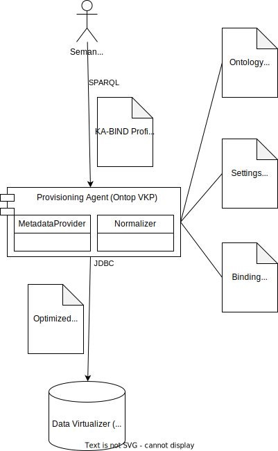

# Tractus-X Provisioning Agent (KA-PROV)

KA-PROV is a module of the [Tractus-X Knowledge Agents Reference Implementations](../README.md).

* see copyright notice in the top folder
* see license file in the top folder
* see authors file in the top folder

## About this Module

This is a folder providing a FOSS implementations of a Data Binding (aka Provisioning) Agent.

Binding Agents are needed by any Agent-Enabled dataspace providers to connect the dataspace protocol/representation (here: a combination of the SPARQL query language/operating on RDF triple graphs) to the underlying business data and logic.

The Provisioning Agent in particular is able to interact with typical relational and structured backend sources based on SQL interfaces. The SPARQL profile which is used is called KA-BIND (the Knowledge Agent Binding Profile).

Commercial alternatives to the FOSS Provisioning Agent are:
* [GraphDB](https://www.ontotext.com/products/graphdb/)
* [Neptune](https://aws.amazon.com/de/neptune/)
* [Stardog](https://www.stardog.com/)
* [Ontopic Studio](https://ontopic.ai/en/)

## Architecture

The FOSS Provisioning Agent uses the [OnTop Virtual Knowledge Graph](https://ontop-vkg.org/) system.



According to their homepage: "... exposes the content of arbitrary relational databases as knowledge graphs. These graphs are virtual, which means that data remains in the data sources instead of being moved to another database."

Ontop operates on four standards: three W3C standards and one ANSI standard. It translates

* incoming *Queries* in a subset/profile of [SparQL 1.1](https://www.w3.org/TR/sparql11-query/). We call that subset KA-BIND.
* using a *Binding* (in Ontop language, its also called a *Mapping*) in [R2RML](https://www.w3.org/TR/r2rml/) (or the slightly simpler Ontop Mapping Language - OBDA)
* from an *Ontology* in [OWL 2 QL](https://www.w3.org/TR/owl2-profiles/#OWL_2_QL) interpretation (and stored either in a Terse Triple Language - TTL or an RDF XML format)
* into largely optimized [*SQL*](https://datacadamia.com/data/type/relation/sql/ansi) queries.

The [Ontop CLI](https://ontop-vkg.org/tutorial/endpoint/endpoint-cli.html) is a Java/Spring application which must
be extended with an appropriate JDBC driver and that can host only one endpoint per port. We have hence extended the original docker entrypoint scripting [resources](resources/entrypoint.sh) such that multiple endpoints and ports can be hosted in a single container. The following environment properties which were originally single-valued can now be set to arrays (where the last entry behaves as the original process to which the container liveness checks are tied to):
* ONTOP_PORT - a list of port numbers to bind the services in the container to
* ONTOP_ONTOLOGY_FILE - a list of local RDF resources (XML or TTL format) which describe the used (domain/use case) ontology. see the [Catena-X Ontology Repository](http://github.com/catenax-ng/product-ontology). For better performance, it is not recommended to include the complete Catena-X Ontology (ontology.ttl) but rather include one of the [Catena-X Use Case Ontology Folder](http://github.com/catenax-ng/product-ontology/tree/main/usecase)
* ONTOP_MAPPING_FILE - a list of mapping files connecting RDF triples with SQL commands/columns either using OBDA or R2RML format
* ONTOP_PROPERTIES_FILE - a list of properties with settings which influence the runtime (e.g. jdbc connection strings and reconfigurations of Ontops internal factories)
* ONTOLOGY_PORTAL_FILE - only needed if web uis for testing the endpoints including some sample queries should be exposed to
* ONTOLOGY_DEV_MODE - a list of boolean flags indicating whether the endpoints should be aware/reload of any changes in the mounted mapping files or ontologies
* JAVA_TOOL_OPTIONS - a list of debug strings to instrument the endpoints with, e.g. to enable remote debugging

Tractus-X focusses on not only accessing traditional SQL databases, such as [PostgreSQL](https://www.postgresql.org/), but also on accessing modern cloud-based data lake/virtualization infrastructures, such as [Dremio](https://www.dremio.com/) and [Druid](https://druid.apache.org/). For that purpose, we have added a few [Ontop Extensions](src/main/java/it/unibz/inf/ontop). These extensions can be activated by setting the right properties in the files referenced by ONTOP_PROPERTIES_FILE
* The ability to add additional schema meta-data via properties. Typically, data virtualization platforms do not define/expose any primary or foreign keys. But Ontop builds its optimization techniques on these definitions. Therefore, you might "simulate" the existance of such keys by entering additional properties. For that purpose, you should configure an instance of the  [KeyAwareDremioDBMetadataProvider](src/main/java/it/unibz/inf/ontop/dbschema/impl/KeyAwareDremioDBMetadataProvider.java)

```console
com.dremio.jdbc.Driver-metadataProvider = it.unibz.inf.ontop.dbschema.impl.KeyAwareDremioDBMetadataProvider
com.dremio.jdbc.Driver-schemas = HI_TEST_OEM, TRACE_TEST_OEM
com.dremio.jdbc.Driver-tables.HI_TEST_OEM = CX_RUL_SerialPartTypization_Vehicle,CX_RUL_SerialPartTypization_Component,CX_RUL_AssemblyPartRelationship,CX_RUL_LoadCollective
com.dremio.jdbc.Driver-unique.HI_TEST_OEM.CX_RUL_SerialPartTypization_Vehicle = UC_VEHICLE
com.dremio.jdbc.Driver-unique.HI_TEST_OEM.CX_RUL_SerialPartTypization_Component = UC_COMPONENT
com.dremio.jdbc.Driver-unique.HI_TEST_OEM.CX_RUL_AssemblyPartRelationship = UC_ASSEMBLY
... 
```
* the ability to optimize to a specific virtualization engine although using a generic REST-based JDBC driver from Apache Calcite

```console
# Use the Data Virtualization backend
jdbc.url=jdbc\:avatica\:remote\:url=http://data-backend:8888/druid/v2/sql/avatica/
jdbc.driver=org.apache.calcite.avatica.remote.Driver
org.apache.calcite.avatica.remote.Driver-metadataProvider = it.unibz.inf.ontop.dbschema.impl.DruidMetadataProvider
org.apache.calcite.avatica.remote.Driver-typeFactory = it.unibz.inf.ontop.model.type.impl.DefaultSQLDBTypeFactory
org.apache.calcite.avatica.remote.Driver-symbolFactory = it.unibz.inf.ontop.model.term.functionsymbol.db.impl.DefaultSQLDBFunctionSymbolFactory 
```

### Security

Besides the authentication of the Ontop engine at the relational database via jdbc (one url/user per endpoint), there are no 
additional (row-level) security mechanism.

Hence we recommend to apply a role-based approach.

For any accessing role:
- define a separate database schema with appropriately filtered views
- define a separate endpoint/port/mapping.

### Data Sources and Scaleablility

For the sample deployments, we use single agent container with an embedded database (H2) and/or a second database virtualization container (Dremio Community Edition) using preloaded files.

Practical deployments will 
* scale and balance the agent containers (for which the lifecycle hooks are already provided).
* use an enterprise-level database (Postgres Service) or database virtualization infrastructure (Dremio Enterprise, Denodo, Teii) that are backed by an appropriate storage system (ADSL, S3, Netapp).

## Deployment

### Compile, Test & Package

```console
mvn package
```

This will generate
- a [pluging jar](target/provisioning-agent-1.9.5-SNAPSHOT.jar) which maybe dropped into an Ontop server (into the lib folder)

### Containerizing (Provisioning Agent)

You could either call

```console
mvn install -Pwith-docker-image
```

or invoke the following docker command after a successful package run

```console
docker build -t ghcr.io/catenax-ng/product-agents/provisioning-agent:1.9.5-SNAPSHOT -f src/main/docker/Dockerfile .
```

The image contains
* the Ontop CLI distribution
* an H2 in-memory database
* JDBC drivers for
  * PostgreSQL
  * Apache Calcite
  * Dremio
* a sample SQL file for database initialisation

To run the docker image using some default data, you could invoke this command

```console
docker run -p 8080:8080 \
  -v $(pwd)/resources/university.ttl:/input/ontology.ttl \
  -v $(pwd)/resources/university-role1.obda:/input/mapping.obda \
  -v $(pwd)/resources/university-role1.properties:/input/settings.properties \
  -v $(pwd)/resources/university.sql:/tmp/university.sql \
  ghcr.io/catenax-ng/product-agents/provisioning-agent:1.9.5-SNAPSHOT
````

Afterwards, you should be able to access the [local SparQL endpoint](http://localhost:8080/) via
the browser or by directly invoking a query

```console
curl --location --request POST 'http://localhost:8080/sparql' \
--header 'Content-Type: application/sparql-query' \
--header 'Accept: application/json' \
--data-raw 'PREFIX : <http://example.org/voc#>

SELECT ?x
WHERE {
   ?x a :Professor .
}'
```

You may manipulate any of the following environment variables to configure the image behaviour.
Note that there is no builtin security (ssl/auth) for the exposed endpoints.
This must be provided by hiding them in an appropriate service network layer.

| ENVIRONMENT VARIABLE        | Required  | Example                                                                | Description                          | List |
|---	                        |---	      |---	                                                                   |---                                   | ---  |
| JAVA_TOOL_OPTIONS           |           | -agentlib:jdwp=transport=dt_socket,server=y,suspend=n,address=*:8090   | JMV (Debugging option)               | X    | 
| ONTOP_PORT                  |           | 8080 (default)                                                         | A port number                        | X    |
| ONTOP_ONTOLOGY_FILE         |           | /input/ontology.ttl (default)                                          | Path to ontology file (ttl or xml)   | X    |
| ONTOP_MAPPING_FILE          |           | /input/mapping.obda (default)                                          | Path to mapping file (obda)          | X    |
| ONTOP_PROPERTIES_FILE       |           | /input/settings.properties (default)                                   | Path to settings file (properties)   | X    |
| ONTOP_PORTAL_FILE           |           | /input/portal.toml                                                     | Path to portal config (toml)         | X    |
| ONTOP_CORS_ALLOWED_ORIGINS  |           | * (default)                                                            | CORS domain name                     |      |
| ONTOP_DEV_MODE              |           | true (default)                                                         | Redeploy endpoint on file changes    | X    |

Here is an example which exposes two endpoints for two different roles (database users, restricted mappings but same ontology)

```console
docker run -p 8080:8080 -p 8082:8082 \
  -v $(pwd)/resources/university.ttl:/input/ontology.ttl \
  -v $(pwd)/resources/university-role1.obda:/input/role1.obda \
  -v $(pwd)/resources/university-role1.properties:/input/role1.properties \
  -v $(pwd)/resources/university-role2.obda:/input/role2.obda \
  -v $(pwd)/resources/university-role2.properties:/input/role2.properties \
  -v $(pwd)/resources/university.sql:/tmp/university.sql \
  -e ONTOP_PORT="8080 8082" \
  -e ONTOP_ONTOLOGY_FILE="/input/ontology.ttl /input/ontology.ttl" \
  -e ONTOP_MAPPING_FILE="/input/role1.obda /input/role2.obda" \
  -e ONTOP_PROPERTIES_FILE="/input/role1.properties /input/role2.properties" \
  -e ONTOP_DEV_MODE="false false" \
  ghcr.io/catenax-ng/product-agents/provisioning-agent:1.9.5-SNAPSHOT
````

Accessing entities spanning two schemas using the first role/endpoint delivers a greater count

```console
curl --location --request POST 'http://localhost:8080/sparql' \
--header 'Content-Type: application/sparql-query' \
--header 'Accept: application/json' \
--data-raw 'PREFIX : <http://example.org/voc#>

SELECT (COUNT(DISTINCT ?x) as ?count)
WHERE {
   ?x a :Course .
}'
```

```json
{
  "head" : {
    "vars" : [
      "count"
    ]
  },
  "results" : {
    "bindings" : [
      {
        "count" : {
          "datatype" : "http://www.w3.org/2001/XMLSchema#integer",
          "type" : "literal",
          "value" : "12"
        }
      }
    ]
  }
}
```

Accessing entities using the restricted role/endpoint delivers a smaller count

```console
curl --location --request POST 'http://localhost:8082/sparql' \
--header 'Content-Type: application/sparql-query' \
--header 'Accept: application/json' \
--data-raw 'PREFIX : <http://example.org/voc#>

SELECT (COUNT(DISTINCT ?x) as ?count)
WHERE {
   ?x a :Course .
}'
```

```json
{
  "head" : {
    "vars" : [
      "count"
    ]
  },
  "results" : {
    "bindings" : [
      {
        "count" : {
          "datatype" : "http://www.w3.org/2001/XMLSchema#integer",
          "type" : "literal",
          "value" : "6"
        }
      }
    ]
  }
}
```

### Helm

A helm chart for deploying the remoting agent can be found under [this folder](../charts/provisioning-agent).

It can be added to your umbrella chart.yaml by the following snippet

```console
dependencies:
  - name: provisioning-agent
    repository: https://catenax-ng.github.io/product-knowledge/infrastructure
    version: 1.9.5-SNAPSHOT
    alias: my-provider-agent
```

and then installed using

```console
helm dependency update
```

In your values.yml, you configure your specific instance of the remoting agent like this

```console
#######################################################################################
# Data Binding Agent
#######################################################################################

my-provider-agent: 
  securityContext: *securityContext
  nameOverride: my-provider-agent
  fullnameOverride: my-provider-agent
  resources:
    requests:
      cpu: 500m
      # you should employ 512Mi per endpoint
      memory: 1Gi
    limits:
      cpu: 500m
      # you should employ 512Mi per endpoint
      memory: 1Gi
  bindings: 
    # disables the default sample binding
    dtc: null
    # real production mapping
    telematics2: 
      port: 8081
      path: /t2/(.*)
      settings: 
        jdbc.url: 'jdbc:postgresql://intradb:5432/schema'
        jdbc.user: <path:vaultpath#username>
        jdbc.password: <path:vaultpath#password>
        jdbc.driver: 'org.postgresql.Driver'
      ontology: cx-ontology.xml
      mapping: |-
        [PrefixDeclaration]
        cx-common:          https://w3id.org/catenax/ontology/common#
        cx-core:            https://w3id.org/catenax/ontology/core#
        cx-vehicle:         https://w3id.org/catenax/ontology/vehicle#
        cx-reliability:     https://w3id.org/catenax/ontology/reliability#
        uuid:		            urn:uuid:
        bpnl:		            bpn:legal:
        owl:		            http://www.w3.org/2002/07/owl#
        rdf:		            http://www.w3.org/1999/02/22-rdf-syntax-ns#
        xml:		            http://www.w3.org/XML/1998/namespace
        xsd:		            http://www.w3.org/2001/XMLSchema#
        json:               https://json-schema.org/draft/2020-12/schema#
        obda:		            https://w3id.org/obda/vocabulary#
        rdfs:		            http://www.w3.org/2000/01/rdf-schema#
        oem:                urn:oem:

        [MappingDeclaration] @collection [[
        mappingId	vehicles
        target		<{vehicle_id}> rdf:type cx-vehicle:Vehicle ; cx-vehicle:vehicleIdentificationNumber {van}^^xsd:string; cx-vehicle:worldManufaturerId bpnl:{localIdentifiers_manufacturerId}; cx-vehicle:productionDate {production_date}^^xsd:date.
        source		SELECT vehicle_id, van, 'BPNL0000000DUMMY' as localIdentifiers_manufacturerId, production_date FROM vehicles

        mappingId	partsvehicle
        target		<{gearbox_id}> cx-vehicle:isPartOf <{vehicle_id}> .
        source		SELECT vehicle_id, gearbox_id FROM vehicles

        mappingId	vehicleparts
        target		<{vehicle_id}> cx-vehicle:hasPart <{gearbox_id}> .
        source		SELECT vehicle_id, gearbox_id FROM vehicles

        ]]  
  ingresses:
    - enabled: true
      # -- The hostname to be used to precisely map incoming traffic onto the underlying network service
      hostname: "my-provider-agent.public.ip"
      annotations:
        nginx.ingress.kubernetes.io/rewrite-target: /$1
        nginx.ingress.kubernetes.io/use-regex: "true"
      # -- Agent endpoints exposed by this ingress resource
      endpoints:
        - telematics2
      tls:
        enabled: true
        secretName: my-provider-tls
```
## Notice

* see copyright notice in the top folder
* see license file in the top folder
* see authors file in the top folder


